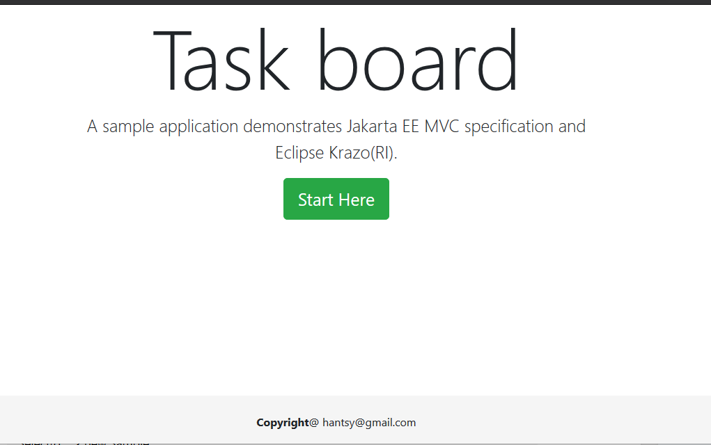

#  Jakarta EE MVC Sample 


As an alternative of Jakarta  Faces which is used to build web UI with components, Jakarta EE MVC spec is similar with the transactional MVC framework, such as Apache Struts,  Spring MVC, etc. which provides capability for building action-based web applications.

In this sample application, we will build a web application with [Jakarta MVC specification](https://www.mvc-spec.org/).  Jakarta MVC is based on the existing  JAX-RS specs, it reuses the JAX-RS APIs, and add some additional APIs   to  the specific *action* features.

[Eclipse Krazo](https://projects.eclipse.org/projects/ee4j.krazo) is the  reference implementation of Jakarta MVC, it supports the following JAXRS platforms.

* Jersey (Glassfish/Payara)
* Resteasy( Wildfly)
* Apache CXF( TomEE)



## Docs

* [Building a web application with Jakarta MVC and Eclipse Krazo](./docs/guide.md)


## Build

1. Clone a copy of the source codes.

   ```bash
   git clone https://github.com/hantsy/jakartaee-mvc-sample
   ```

2. Run on Glassfish, Wildfly or Open Liberty.

   ```bash
   mvn clean package cargo:run -pglassfish-local
   mvn clean wildfly:run -Pwildfly
   mvn clean liberty:create dependency:copy liberty:run -Popenliberty
   ```
   

## Reference 

* [MVC spec](https://www.mvc-spec.org/)
*  [Eclipse Krazo](https://projects.eclipse.org/projects/ee4j.krazo)
