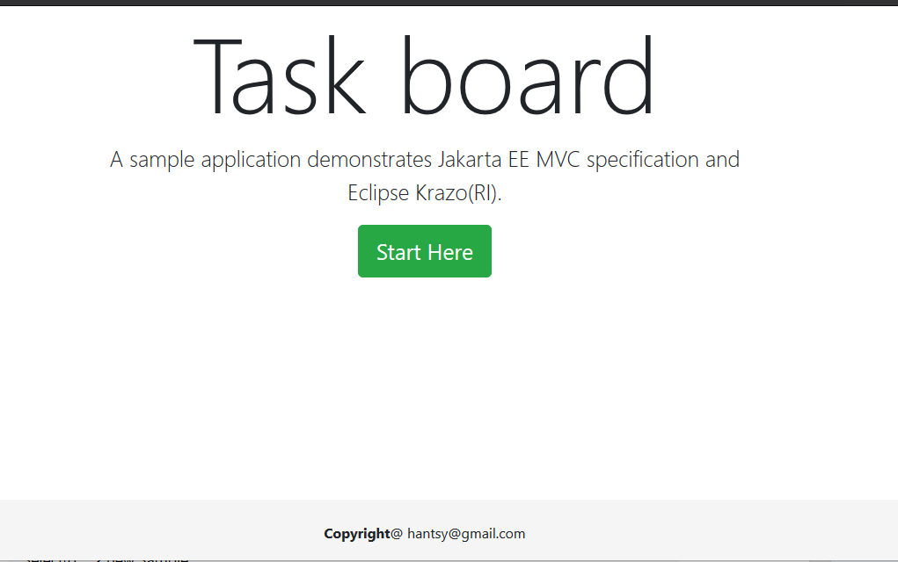
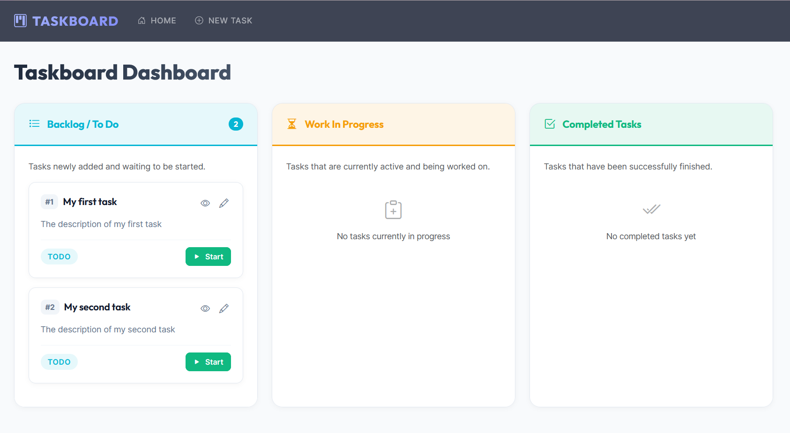

# JakartaEE MVC Sample

[](https://github.com/hantsy/jakartaee-mvc-sample/actions/workflows/build.yml)

[Jakarta MVC](https://jakarta.ee/specifications/mvc/) offers an alternative to [Jakarta Faces](https://jakarta.ee/specifications/faces/). Instead of a component-based UI, it follows a traditional action-based MVC approach similar to frameworks such as **Apache Struts** or **Spring MVC**, making it easy to build web applications with controllers and views.

This repository has been updated to **Jakarta EE 11 / Jakarta MVC 3.0**.

> [!Note]
> Jakarta MVC is not part of Jakarta EE 11, but it may be included in a future release. GlassFish already ships with built-in Jakarta MVC support.

The following screenshots show the running example application, which is a simple task list manager. The home page displays the list of tasks, and the "Add Task" page allows users to create new tasks.





### Older releases

* **Jakarta EE 10:** see the [EE 10 archive release](https://github.com/hantsy/jakartaee-mvc-sample/releases/tag/ee10).
* **Jakarta EE 8:** see the [v1.0 archive release](https://github.com/hantsy/jakartaee-mvc-sample/releases/tag/v1.0).

---

## Background

Jakarta MVC is built on top of the Jakarta REST API, reusing its annotations and request/response model, and adds specialized APIs for action-oriented workflows.

[Eclipse Krazo](https://projects.eclipse.org/projects/ee4j.krazo) is currently the only Jakarta MVC implementation; it supports the following Jakarta REST runtimes:

* Jersey (GlassFish / Payara)
* RESTEasy (WildFly)
* ~~Apache CXF~~ – support removed in MVC 2.0

> [!Warning]
> Jakarta MVC 3.0 / Eclipse Krazo 4.0 replaced Facelets with Jakarta Pages as the default view engine. Because Jakarta Pages lacks a composite-view layout mechanism, this sample restores the deleted `FaceletsViewEngine` and continues using the original Facelets views.


## Documentation

* [Building a web application with Jakarta MVC and Eclipse Krazo (Jakarta EE 8)](./docs/guide.md)


## Prerequisites

* Java 21
* Apache Maven 3.x or 4.x (latest)

## Building and running

1. Clone the repository:

   ```bash
   git clone https://github.com/hantsy/jakartaee-mvc-sample
   ```

2. Start the application on GlassFish:

   ```bash
   mvn clean package cargo:run -pglassfish
   ```

3. Run the integration tests against the GlassFish managed adapter:

   ```bash
   mvn clean verify -Parg-glassfish-managed
   ```

> [!Warning]
> To cut down on maintenance, configuration for WildFly, OpenLiberty, Payara, etc. has been removed. If you need to run on those servers, please consult the [jakartaee9‑starter‑boilerplate](https://github.com/hantsy/jakartaee9-starter-boilerplate) or [jakartaee10‑starter‑boilerplate](https://github.com/hantsy/jakartaee10-starter-boilerplate) projects and add the appropriate configuration yourself.

---

## References

* [MVC Specification](https://www.mvc-spec.org/)
* [Eclipse Krazo project](https://projects.eclipse.org/projects/ee4j.krazo)
